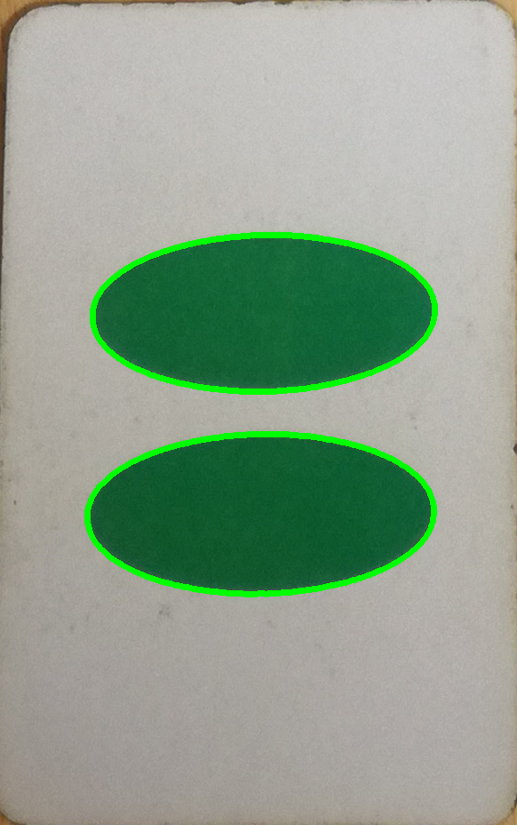

# Set_Game_Compter_Vision

A computer vision project to play the card game 'Set' ( https://en.wikipedia.org/wiki/Set_(card_game) ).

The code can be seen both as a Jupyter Notebook and in the `detect_card.py` file!

This project has a lot of scope for optimisation but is currently robust.

There are some tools within `tools` to calibrate the HSV values within the function `def check_colour(img, card_props):` in `detect_card.py`

## Input Images:

## Output:

Correct analysis: 
`{'shape': 1, 'fill': 1, 'number': 2, 'colour': 1}` and `{'shape': 2, 'fill': 3, 'number': 2, 'colour': 3}`

Card: 

    
    

